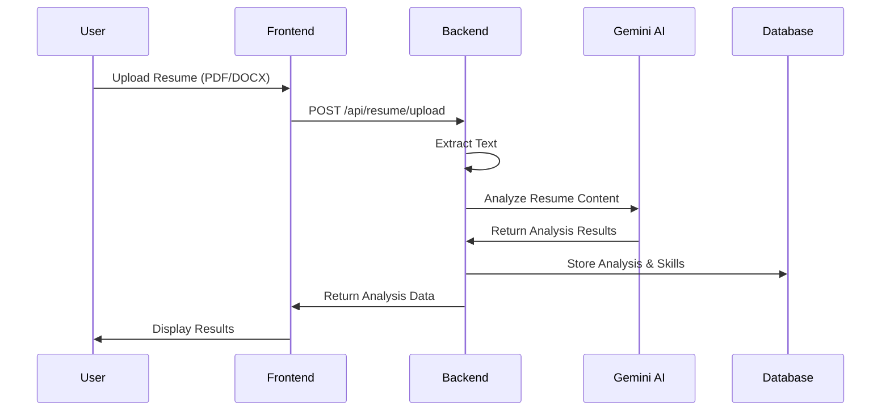

# Resume Validator - AI-Powered Resume Analysis Platform

<div align="center">
  <h1>🎯 Resume Validator</h1>
  <p><strong>Intelligent Resume Analysis with AI-Powered Job Matching</strong></p>
  
  <p>
    
    
    
    
    
  </p>
</div>

## 🚀 Overview

Resume Validator is a comprehensive full-stack application that leverages artificial intelligence to analyze resumes, extract skills, and match candidates with relevant job opportunities in the Indian market. Built with modern technologies, it provides an intuitive user experience for both job seekers and recruiters.

### ✨ Key Features

- **🤖 AI-Powered Analysis**: Google Gemini AI integration for intelligent resume parsing
- **📊 Skill Extraction**: Automatic identification and categorization of technical and soft skills
- **🎯 Job Matching**: Real-time job recommendations based on skill compatibility
- **📱 Responsive Design**: Modern, mobile-first interface with smooth animations
- **🔐 Secure Authentication**: JWT-based user authentication and authorization
- **☁️ Cloud Storage**: Cloudinary integration for secure file storage
- **📈 Progress Tracking**: Visual analytics and career progression insights

## 🏗️ Architecture Overview

```
┌─────────────────┐    ┌─────────────────┐    ┌─────────────────┐
│                 │    │                 │    │                 │
│   Frontend      │◄──►│    Backend      │◄──►│   Database      │
│   (React TS)    │    │   (Node.js)     │    │   (MongoDB)     │
│                 │    │                 │    │                 │
└─────────────────┘    └─────────────────┘    └─────────────────┘
         │                       │                       │
         │                       │                       │
    ┌────▼────┐              ┌───▼───┐              ┌────▼────┐
    │ Vite    │              │ APIs  │              │ Models  │
    │ Tailwind│              │ Auth  │              │ Users   │
    │ Framer  │              │ Files │              │ Resumes │
    └─────────┘              └───────┘              └─────────┘
```

### 🔧 Technology Stack

#### Frontend
- **React 18** with TypeScript for type-safe development
- **Vite** for fast development and optimized builds
- **Tailwind CSS** for utility-first styling
- **Framer Motion** for smooth animations and transitions
- **React Router** for client-side routing
- **Context API** for state management

#### Backend
- **Node.js** with Express.js framework
- **MongoDB** with Mongoose ODM
- **JWT** for authentication and authorization
- **Multer** for file upload handling
- **Cloudinary** for cloud-based file storage

#### AI & External Services
- **Google Gemini AI** for resume analysis and skill extraction
- **RapidAPI JSearch** for real-time job matching
- **PDF-Parse & Mammoth** for document text extraction

## 🚀 Quick Start

### Prerequisites

Ensure you have the following installed:
- **Node.js** (v16 or higher)
- **MongoDB** (local installation or Atlas account)
- **npm** or **yarn** package manager

### 1. Clone the Repository

```bash
git clone https://github.com/your-username/resume-validator.git
cd resume-validator
```

### 2. Backend Setup

```bash
# Navigate to backend directory
cd backend

# Install dependencies
npm install

# Create environment file
cp .env.example .env

# Configure your environment variables in .env file
# (See Environment Variables section below)

# Start the development server
npm run dev
```

The backend server will start on `http://localhost:5000`

### 3. Frontend Setup

```bash
# Navigate to frontend directory (from project root)
cd frontend

# Install dependencies
npm install

# Start the development server
npm run dev
```

The frontend application will start on `http://localhost:3000`

### 4. Environment Variables

#### Backend (.env)

```env
# Database Configuration
MONGODB_URI=mongodb://localhost:27017/resume_validator

# JWT Configuration
JWT_SECRET=your_super_secret_jwt_key_here
JWT_EXPIRES_IN=7d

# AI Services
GEMINI_API_KEY=your_gemini_api_key

# Job Search API
RAPIDAPI_KEY=your_rapidapi_key

# File Storage
CLOUDINARY_CLOUD_NAME=your_cloudinary_cloud_name
CLOUDINARY_API_KEY=your_cloudinary_api_key
CLOUDINARY_API_SECRET=your_cloudinary_api_secret

# Development Settings
NODE_ENV=development
PORT=5000
SKIP_AUTH=true  # Only for development
```

#### Frontend (.env)

```env
# API Configuration
VITE_API_URL=http://localhost:5000/api

# Application Settings
VITE_APP_NAME=Resume Validator
VITE_ENABLE_DEMO_MODE=true
```

## 📂 Project Structure

```
resume-validator/
├── backend/                 # Node.js backend application
│   ├── controllers/        # Request handlers and business logic
│   ├── middleware/         # Authentication and error handling
│   ├── models/            # MongoDB/Mongoose schemas
│   ├── routes/            # API route definitions
│   ├── services/          # External service integrations
│   ├── utils/             # Utility functions
│   ├── server.js          # Application entry point
│   └── package.json       # Backend dependencies
│
├── frontend/               # React TypeScript frontend
│   ├── src/
│   │   ├── components/    # Reusable UI components
│   │   ├── pages/         # Page components
│   │   ├── context/       # React Context providers
│   │   ├── utils/         # Frontend utilities
│   │   └── resources/     # Static assets
│   ├── public/            # Public static files
│   ├── package.json       # Frontend dependencies
│   └── vite.config.ts     # Vite configuration
│
├── docs/                  # Documentation files
├── README.md              # This file
└── .gitignore            # Git ignore rules
```

## 🎯 Core Features Deep Dive

### 1. Resume Upload & Analysis



### 2. Skill-Based Job Matching

- **Automatic Skill Extraction**: AI identifies technical and soft skills from resume content
- **Skill Categorization**: Groups skills into technical, soft, language, and certification categories
- **Proficiency Detection**: Determines skill levels (beginner, intermediate, advanced, expert)
- **Job Matching Algorithm**: Matches user skills with job requirements using similarity scoring
- **Real-time Search**: Integrates with RapidAPI for current job listings in India

### 3. User Authentication & Security

- **JWT Authentication**: Secure token-based authentication system
- **Password Hashing**: bcrypt for secure password storage
- **Protected Routes**: Client and server-side route protection
- **Session Management**: Secure token handling with httpOnly cookies

## 📊 API Documentation

### Authentication Endpoints

| Method | Endpoint | Description | Authentication |
|--------|----------|-------------|----------------|
| POST | `/api/auth/register` | User registration | None |
| POST | `/api/auth/login` | User login | None |
| GET | `/api/auth/me` | Get current user | Required |

### Resume Management

| Method | Endpoint | Description | Authentication |
|--------|----------|-------------|----------------|
| POST | `/api/resume/upload` | Upload and analyze resume | Required |
| GET | `/api/resume/history` | Get user's resume history | Required |
| GET | `/api/resume/:id` | Get specific analysis | Required |
| DELETE | `/api/resume/:id` | Delete resume | Required |

### Skills & Job Matching

| Method | Endpoint | Description | Authentication |
|--------|----------|-------------|----------------|
| GET | `/api/skills` | Get extracted user skills | Required |
| PUT | `/api/skills` | Update user skills | Required |
| GET | `/api/jobs/search` | Search jobs with matching | Required |

## 🎨 User Interface

### Design Philosophy

- **Minimal & Clean**: Focus on content with distraction-free design
- **Mobile-First**: Responsive design optimized for all devices
- **Accessibility**: WCAG 2.1 compliant with keyboard navigation
- **Performance**: Optimized loading and smooth animations

### Key UI Components

- **Dynamic Progress Indicators**: Real-time analysis progress with video animations
- **Interactive Job Cards**: Skill match visualization with expandable details
- **Responsive File Upload**: Drag-and-drop interface with validation feedback
- **Animated Transitions**: Framer Motion powered page and component animations

## 🚀 Deployment

### Development Environment

```bash
# Start both frontend and backend in development mode
npm run dev:full

# Or start individually
npm run dev:backend  # Start backend only
npm run dev:frontend # Start frontend only
```

### Production Deployment

#### Using Docker

```dockerfile
# Backend Dockerfile
FROM node:18-alpine
WORKDIR /app
COPY package*.json ./
RUN npm ci --only=production
COPY . .
EXPOSE 5000
CMD ["npm", "start"]
```

```dockerfile
# Frontend Dockerfile
FROM node:18-alpine as build
WORKDIR /app
COPY package*.json ./
RUN npm ci
COPY . .
RUN npm run build

FROM nginx:alpine
COPY --from=build /app/dist /usr/share/nginx/html
EXPOSE 80
CMD ["nginx", "-g", "daemon off;"]
```

#### Using Docker Compose

```yaml
version: '3.8'
services:
  backend:
    build: ./backend
    ports:
      - "5000:5000"
    environment:
      - NODE_ENV=production
      - MONGODB_URI=mongodb://mongo:27017/resume_validator
    depends_on:
      - mongo

  frontend:
    build: ./frontend
    ports:
      - "80:80"
    depends_on:
      - backend

  mongo:
    image: mongo:latest
    ports:
      - "27017:27017"
    volumes:
      - mongo_data:/data/db

volumes:
  mongo_data:
```

### Cloud Deployment Options

#### Backend Deployment
- **Heroku**: Easy deployment with MongoDB Atlas
- **DigitalOcean App Platform**: Managed container platform
- **AWS EC2**: Full control with custom configuration
- **Google Cloud Run**: Serverless container deployment

#### Frontend Deployment
- **Netlify**: Automatic builds from Git with CDN
- **Vercel**: Zero-config deployment with edge functions
- **AWS S3 + CloudFront**: Static hosting with global CDN
- **GitHub Pages**: Free hosting for open source projects

## 🧪 Testing

### Backend Testing

```bash
# Run backend tests
cd backend
npm test

# Run with coverage
npm run test:coverage

# Run integration tests
npm run test:integration
```

### Frontend Testing

```bash
# Run frontend tests
cd frontend
npm test

# Run E2E tests
npm run test:e2e

# Run accessibility tests
npm run test:a11y
```

### Test Coverage Goals
- **Unit Tests**: 80%+ coverage for business logic
- **Integration Tests**: All API endpoints
- **E2E Tests**: Critical user journeys
- **Accessibility Tests**: WCAG 2.1 compliance

## 📈 Performance Optimization

### Frontend Optimization
- **Code Splitting**: Lazy loading for route-based chunks
- **Image Optimization**: WebP format with lazy loading
- **Bundle Analysis**: Webpack Bundle Analyzer for size optimization
- **Caching**: Service worker for offline functionality

### Backend Optimization
- **Database Indexing**: Optimized queries with proper indexes
- **Caching**: Redis for session and API response caching
- **Compression**: Gzip compression for API responses
- **Rate Limiting**: Prevent abuse with configurable limits

## 🔧 Configuration Options

### Feature Flags

```env
# Frontend Feature Flags
VITE_ENABLE_DEMO_MODE=true
VITE_ENABLE_ANALYTICS=false
VITE_ENABLE_OFFLINE_MODE=false

# Backend Feature Flags
ENABLE_RATE_LIMITING=true
ENABLE_CORS=true
ENABLE_COMPRESSION=true
```

### Customization

- **Theme Configuration**: Easily customizable design tokens
- **API Endpoints**: Configurable external service endpoints
- **File Upload Limits**: Adjustable file size and type restrictions
- **Analysis Parameters**: Tunable AI analysis parameters

## 🤝 Contributing

We welcome contributions! Please follow these guidelines:

### Development Process

1. **Fork the repository** and create a feature branch
2. **Install dependencies** and set up the development environment
3. **Make your changes** following our coding standards
4. **Write tests** for new functionality
5. **Run the test suite** to ensure nothing is broken
6. **Submit a pull request** with a clear description

### Code Standards

- **ESLint**: Follow the configured linting rules
- **Prettier**: Use consistent code formatting
- **TypeScript**: Maintain type safety throughout
- **Commit Messages**: Use conventional commit format

### Pull Request Process

1. Update documentation for any new features
2. Ensure all tests pass and coverage requirements are met
3. Request review from maintainers
4. Address feedback and make necessary changes

## 📞 Support & Community

### Getting Help

- **Documentation**: Check the `/docs` folder for detailed guides
- **GitHub Issues**: Report bugs and request features
- **Discussions**: Join community discussions for questions
- **Email**: Contact the maintainers directly

### Community Guidelines

- Be respectful and inclusive
- Help others learn and grow
- Follow the code of conduct
- Share knowledge and best practices

## 📄 License

This project is licensed under the MIT License - see the [LICENSE](LICENSE) file for details.

## 🙏 Acknowledgments

- **Google Gemini AI** for powerful resume analysis capabilities
- **RapidAPI** for job search integration
- **Cloudinary** for reliable file storage solutions
- **Open Source Community** for the amazing tools and libraries

## 🔄 Version History & Roadmap

### Current Version: v1.5.0

#### Recent Updates
- ✅ Enhanced job matching with skill-based sorting
- ✅ Improved video animation for upload progress
- ✅ Added comprehensive skill categorization
- ✅ Implemented user-specific skill storage

#### Upcoming Features (v2.0.0)
- 🔄 Advanced analytics dashboard
- 🔄 Resume optimization suggestions
- 🔄 Interview preparation tools
- 🔄 Company culture matching
- 🔄 Progressive Web App (PWA) support
- 🔄 Multi-language support

---

<div align="center">
  <p><strong>Built with ❤️ by the Resume Validator Team</strong></p>
  <p>
    <a href="#top">Back to Top</a> •
    <a href="./backend/README.md">Backend Docs</a> •
    <a href="./frontend/README.md">Frontend Docs</a> •
    <a href="./docs/API.md">API Reference</a>
  </p>
</div>